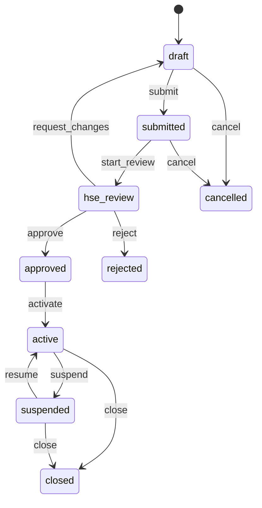

# ۳) موتور BPMS — Symfony Workflow Component

## ۳.۱ چرا Workflow Component؟
این تنها مزیت واقعی Symfony نسبت به NestJS بود (طبق سند مرجع، بخش ۸.۱) و دقیقاً محور اصلی فاز فعلی («ابتدا BPMS را بسازیم») است: state machine اعلامی (YAML)، بدون کتابخانهٔ اضافه، با ابزار Graphviz توکار برای رسم دیاگرام:

```bash
php bin/console workflow:dump permit_to_work | dot -Tpng -o permit_to_work.png
```

## ۳.۲ گردش‌کار مجوز کار (`permit_to_work`)

```yaml
# config/packages/workflow.yaml
framework:
    workflows:
        permit_to_work:
            type: state_machine
            audit_trail:
                enabled: true
            marking_store:
                type: method
                property: status
            supports:
                - App\Domain\Permit\Entity\Permit
            initial_marking: draft
            places:
                - draft
                - submitted
                - hse_review
                - approved
                - active
                - suspended
                - closed
                - cancelled
                - rejected
            transitions:
                submit:
                    from: draft
                    to: submitted
                start_review:
                    from: submitted
                    to: hse_review
                request_changes:
                    from: hse_review
                    to: draft
                approve:
                    from: hse_review
                    to: approved
                reject:
                    from: hse_review
                    to: rejected
                activate:
                    from: approved
                    to: active
                suspend:
                    from: active
                    to: suspended
                resume:
                    from: suspended
                    to: active
                close:
                    from: [active, suspended]
                    to: closed
                cancel:
                    from: [draft, submitted]
                    to: cancelled
```

### دیاگرام حالت (خلاصه)



### Guard ها (ABAC از طریق Voter)
هر transition حساس با یک Guard Listener محافظت می‌شود که به Voter مربوطه رجوع می‌کند:

```php
#[AsEventListener(event: 'workflow.permit_to_work.guard.approve')]
final class PermitApproveGuard
{
    public function __construct(private Security $security) {}

    public function __invoke(GuardEvent $event): void
    {
        /** @var Permit $permit */
        $permit = $event->getSubject();

        if (!$this->security->isGranted('PERMIT_APPROVE', $permit)) {
            $event->setBlocked(true, 'شما مجاز به تأیید این مجوز نیستید.');
        }

        // تعارض SIMOPS: بلوکه‌کردن اگر مجوز فعال دیگری روی همان تجهیز/ناحیه باز است
        if ($this->hasActiveConflict($permit)) {
            $event->setBlocked(true, 'مجوز فعال دیگری با تعارض SIMOPS روی این تجهیز باز است.');
        }
    }
}
```

### Transition Listener (نوشتن Audit + اعلان)
```php
#[AsEventListener(event: 'workflow.permit_to_work.transition')]
final class PermitAuditSubscriber
{
    public function __construct(private AuditLogger $audit) {}

    public function __invoke(TransitionEvent $event): void
    {
        $this->audit->record(
            entity: 'permit',
            entityId: $event->getSubject()->getId(),
            action: $event->getTransition()->getName(),
        );
    }
}
```

## ۳.۳ گردش‌کار مدیریت تغییر (`moc_workflow`)

```yaml
        moc_workflow:
            type: state_machine
            marking_store:
                type: method
                property: status
            supports:
                - App\Domain\Moc\Entity\MocRequest
            initial_marking: proposed
            places:
                - proposed
                - risk_assessment
                - approval
                - implementation
                - pssr
                - closed
                - rejected
            transitions:
                start_risk_assessment:
                    from: proposed
                    to: risk_assessment
                submit_for_approval:
                    from: risk_assessment
                    to: approval
                approve:
                    from: approval
                    to: implementation
                reject:
                    from: approval
                    to: rejected
                start_pssr:
                    from: implementation
                    to: pssr
                close:
                    from: pssr
                    to: closed
```

مطابق API 754، هر MOC باید یک PSSR (Pre-Startup Safety Review) قبل از بستن داشته باشد — این در state machine بالا اجباری‌شده (نمی‌توان از `implementation` مستقیم به `closed` رفت).

## ۳.۴ گردش‌کار حادثه (نسخهٔ ساده فاز ۱)
```
reported → under_investigation → capa_assigned → closed
```
(بدون Symfony Workflow جداگانه در فاز ۱ — فقط یک enum status ساده؛ اگر پیچیدگی رشد کرد، در فاز ۲ به Workflow Component مهاجرت می‌کند.)

## ۳.۵ چرا از این هم برای PetroOps استفاده نکردیم؟
Aria PetroOps (خواهر این سامانه) از **XState** در NestJS استفاده می‌کند نه Symfony Workflow — چون آن سامانه اصلاً Symfony نیست. جزئیات در `aria-petroops/docs/03-bpms-workflow.md`.
