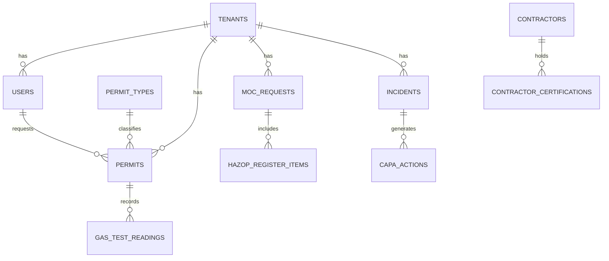

# ۴) مدل داده — Aria SafeOps

## ۴.۱ موتور دیتابیس
PostgreSQL 16 + پسوند TimescaleDB (`timescale/timescaledb:2.17.2-pg16`). TimescaleDB در فاز ۱ فقط برای دادهٔ رابطه‌ای معمولی استفاده می‌شود (hypertable لازم نیست)؛ پسوند از روز اول فعال است تا اگر بعداً قرائت‌های گاز‌تست/سنسور با فرکانس بالا وارد شد، بدون migration معماری بزرگ به hypertable تبدیل شود.

```sql
CREATE EXTENSION IF NOT EXISTS timescaledb;
```

## ۴.۲ جدول‌های اصلی (فاز ۱)

### `tenants`
| ستون | نوع | توضیح |
|---|---|---|
| id | uuid PK | |
| name | varchar | نام مشتری/سایت |
| created_at | timestamptz | |

### `users`
| ستون | نوع | توضیح |
|---|---|---|
| id | uuid PK | |
| tenant_id | uuid FK → tenants | RLS روی این ستون |
| username | varchar unique | شناسهٔ ورود (در لوکال و Production: `alireza`) |
| email | varchar unique | |
| password_hash | varchar | Symfony PasswordHasher (bcrypt/argon2id) |
| roles | jsonb | `["ROLE_PERMIT_ISSUER", "ROLE_HSE_MANAGER"]` |
| full_name | varchar | |
| created_at | timestamptz | |

### `permit_types`
| ستون | نوع | توضیح |
|---|---|---|
| id | uuid PK | |
| code | varchar | `hot_work`, `cold_work`, `confined_space`, `working_at_height`, `excavation`, `electrical` |
| name_fa` / `name_en` | varchar | |
| requires_gas_test | boolean | |
| requires_isolation | boolean | LOTO |

### `permits`
| ستون | نوع | توضیح |
|---|---|---|
| id | uuid PK | |
| tenant_id | uuid FK | |
| permit_type_id | uuid FK → permit_types | |
| status | varchar | Marking سازگار با `permit_to_work` workflow |
| equipment_tag | varchar | برای بلوکه‌کردن آینده با PetroOps (تعارض/آنومالی) |
| location_plot_ref | varchar | مرجع روی Plot Plan (برای تشخیص SIMOPS فاز ۲) |
| requested_by, approved_by | uuid FK → users | |
| valid_from, valid_to | timestamptz | |
| jsa_reference | jsonb | برای پیش‌نویس هوشمند از تاریخچهٔ JSA (فاز ۲/AI) |
| created_at, updated_at | timestamptz | |

### `permit_transitions_log`
تولید خودکار توسط `audit_trail: enabled: true` در Symfony Workflow — هر رکورد گذار (transition) با actor و timestamp.

### `gas_test_readings`
| ستون | نوع | توضیح |
|---|---|---|
| id | uuid PK | |
| permit_id | uuid FK | |
| gas_type | varchar | O2, LEL, H2S, CO |
| reading_value | numeric | |
| recorded_at | timestamptz | |
| recorded_by | uuid FK → users | |

### `moc_requests`
| ستون | نوع | توضیح |
|---|---|---|
| id | uuid PK | |
| tenant_id | uuid FK | |
| status | varchar | Marking سازگار با `moc_workflow` |
| change_type | varchar | `temporary` / `permanent` / `emergency` |
| description | text | |
| equipment_tag | varchar | لینک آینده به رجیستر دارایی PetroOps |
| requested_by | uuid FK | |
| pssr_completed_at | timestamptz nullable | |

### `hazop_register_items`
| ستون | نوع | توضیح |
|---|---|---|
| id | uuid PK | |
| moc_request_id | uuid FK nullable | |
| node_description | text | |
| deviation | varchar | مطابق روش‌شناسی HAZOP |
| cause, consequence | text | |
| safeguards | text | |
| risk_ranking | varchar | Low/Medium/High/Critical |

### `incidents`
| ستون | نوع | توضیح |
|---|---|---|
| id | uuid PK | |
| tenant_id | uuid FK | |
| type | varchar | `near_miss` / `incident` / `injury` |
| severity | varchar | |
| status | varchar | `reported` → `under_investigation` → `capa_assigned` → `closed` |
| description | text | |
| location | varchar | |
| reported_by | uuid FK | |
| reported_at | timestamptz | |

### `capa_actions`
| ستون | نوع | توضیح |
|---|---|---|
| id | uuid PK | |
| incident_id | uuid FK | |
| description | text | |
| assigned_to | uuid FK → users | |
| due_date | date | |
| status | varchar | `open` / `in_progress` / `verified` / `closed` |

### `contractors` / `contractor_certifications`
| ستون | نوع | توضیح |
|---|---|---|
| id | uuid PK | |
| company_name | varchar | |
| hse_prequalification_score | numeric nullable | |
| certification: type, expires_at | varchar, date | برای هشدار انقضا |

### `audit_log` (Hash-chain — الزام امنیتی)
| ستون | نوع | توضیح |
|---|---|---|
| id | bigserial PK | |
| tenant_id | uuid | |
| entity, entity_id | varchar, uuid | |
| action | varchar | |
| actor_id | uuid nullable | |
| payload | jsonb | |
| prev_hash | varchar(64) | |
| hash | varchar(64) | |
| created_at | timestamptz | |

### `ai_query_log` — **جدول Placeholder (بخش ۶)**
| ستون | نوع | توضیح |
|---|---|---|
| id | uuid PK | |
| tenant_id | uuid | |
| user_id | uuid FK | |
| query_text | text | |
| response_text | text nullable | |
| status | varchar | همیشه `unavailable` تا زمان فعال‌سازی واقعی AI Gateway |
| created_at | timestamptz | |

> این جدول از الان ساخته می‌شود تا وقتی AI Gateway واقعی وصل شد، نیازی به Migration دردسرساز روی دادهٔ Production نباشد — فقط منطق نوشتن پاسخ واقعی جای stub را می‌گیرد.

## ۴.۳ دیاگرام رابطه (خلاصه)



## ۴.۴ Migration Strategy
Doctrine Migrations (`doctrine/doctrine-migrations-bundle`) — یک migration به‌ازای هر تغییر schema، اجرا خودکار در مرحلهٔ CI/CD قبل از `docker compose up -d` (جزئیات در [`09-ci-cd.md`](09-ci-cd.md)).
