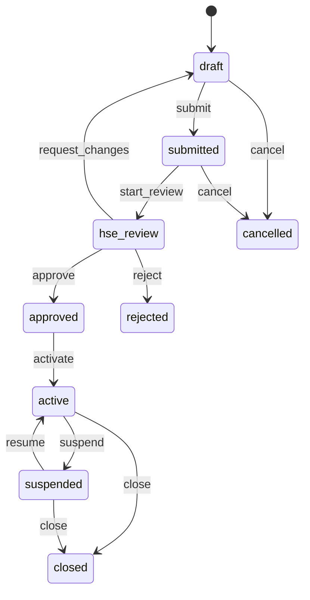

# 3) BPMS — Symfony Workflow

English technical manual. Persian original: [`../03-bpms-workflow.md`](../03-bpms-workflow.md).  
Source of truth: `config/packages/workflow.yaml`.

Dump a diagram:

```bash
php bin/console workflow:dump permit_to_work | dot -Tpng -o permit_to_work.png
php bin/console workflow:dump moc_workflow | dot -Tpng -o moc_workflow.png
```

## 3.1 Permit-to-work (`permit_to_work`)

Places: `draft`, `submitted`, `hse_review`, `approved`, `active`, `suspended`, `closed`, `cancelled`, `rejected`.

| Transition | From | To |
|---|---|---|
| submit | draft | submitted |
| start_review | submitted | hse_review |
| request_changes | hse_review | draft |
| approve | hse_review | approved |
| reject | hse_review | rejected |
| activate | approved | active |
| suspend | active | suspended |
| resume | suspended | active |
| close | active, suspended | closed |
| cancel | draft, submitted | cancelled |



Guards (non-exhaustive): role (Voter), gas-test policy when the type requires it, isolation flag when required, **equipment hold** from PetroOps on activate/resume (and on create).

## 3.2 MOC (`moc_workflow`)

Places: `proposed`, `risk_assessment`, `approval`, `implementation`, `pssr`, `closed`, `rejected`.

PSSR is a real state: `implementation → pssr → closed`. There is no transition that skips PSSR.

Equipment hold also blocks entering implementation (subscriber + shared `EquipmentHoldChecker`).

## 3.3 Incidents

Incidents use a dedicated PHP state helper (`IncidentStatusMachine`), not the YAML workflow file. CAPA items hang off the incident.

## 3.4 Why not Temporal here

Permits and MOCs are human-approval workflows that complete in hours/days and fit Symfony Workflow. Multi-week TAR orchestration belongs to PetroOps Phase 3 (Temporal), not this service.
